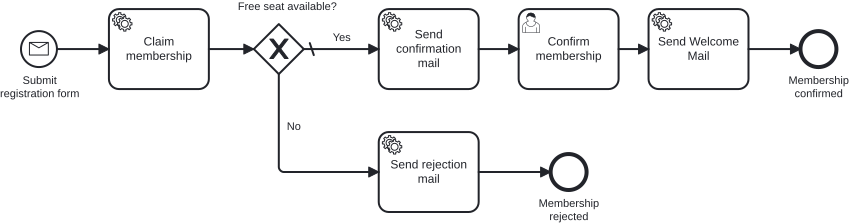

# Aufgabe 6 – Den Prozess mit Tests absichern

> **Voraussetzung:** Aufgabe 5 ist abgeschlossen – Gateway, Kapazitätsprüfung und beide Prozessausgänge laufen.
> **Arbeitsverzeichnis:** `services/process-application`
> **Neu in dieser Aufgabe:** In-Memory-Engine mit h2, abgeschalteter Job Executor, `@MockitoBean`, Assertions mit `BpmnAwareTests`.

## Darum geht es

**Montagmorgen. Der Prozess läuft. Angeblich.**

Du hast einen ordentlichen Prozess gebaut: Gateway, Bestätigungs-Mail, Ablehnung. In der
Cockpit-Demo hat alles funktioniert – einmal. Aber woher weißt du, dass er **nächste Woche
noch** funktioniert, wenn jemand ein Boundary Event anhängt, einen Sequenzfluss umbiegt oder
eine Bedingung dreht?

Klickst du dann jedes Mal durchs Cockpit? Startest PostgreSQL, schickst curl-Aufrufe ab,
liest Logs? Das macht niemand zuverlässig. Genau da sterben Prozesse leise: Ein Sequenzfluss
zeigt nach dem Refactoring ins Leere, das Gateway nimmt den falschen Pfad – und keiner merkt
es, bis jemand trotz freiem Platz eine Absage bekommt.

> *„Works on my machine" ist kein Testkonzept. Es ist eine Ausrede mit besserer PR.*

Ein **Prozess-Test** startet den echten Prozess in einer In-Memory-Engine, lässt die echten
Delegates laufen und ersetzt nur die Fachlogik dahinter durch Mocks. Welchen Weg die
Prozessinstanz nehmen muss, steht danach als **Assertion** im Test – überprüfbar bei jedem
Build statt einmalig in einer Demo.

## Lernziele

Nach dieser Aufgabe kannst du

- einen Prozess als Unit-Test absichern, ohne PostgreSQL und ohne laufende Infrastruktur,
- die Engine im Test auf h2 und mit abgeschaltetem Job Executor betreiben,
- die Use Cases hinter den Delegates mit `@MockitoBean` gezielt mocken,
- die Async-Continuations im Test selbst ausführen und die Instanz damit kontrolliert bis
  zum nächsten Wait State bringen,
- Prozesspfade mit `BpmnAwareTests` prüfen (`isWaitingAt`, `hasPassedInOrder`, `isEnded`).

## Ziel-Modell



Es kommt **kein neues Modell** dazu. Du testest den Prozess aus Aufgabe 5: Message Start →
Claim → Gateway → Bestätigung → Willkommens-Mail beziehungsweise Ablehnung.

Referenzmodell (unverändert gegenüber Aufgabe 5): `../../models/exercise-06/membership.bpmn`

## Aufgabe

### 1. Test-Dependency ergänzen

Die Assertions kommen aus dem Operaton-Port von `camunda-bpm-assert`. Die Version ist
zentral in der Root-`pom.xml` gemanagt:

```xml
<dependency>
    <groupId>org.operaton.bpm</groupId>
    <artifactId>operaton-bpm-assert</artifactId>
    <scope>test</scope>
</dependency>
```

`spring-boot-starter-test` (JUnit 5, Mockito, AssertJ) und `h2` sind bereits vorhanden.

### 2. Testprofil anlegen

**Neue Datei:** `src/test/resources/application-test.yaml`

```yaml
spring:
  main:
    allow-bean-definition-overriding: true
  datasource:
    url: jdbc:h2:mem:operaton-test;DB_CLOSE_DELAY=-1;INIT=CREATE SCHEMA IF NOT EXISTS exercise
    username: sa
    password:
    driver-class-name: org.h2.Driver
  jpa:
    hibernate:
      ddl-auto: create-drop
    properties:
      hibernate:
        dialect: org.hibernate.dialect.H2Dialect
        default_schema: exercise

operaton:
  bpm:
    admin-user:
      id: admin
      password: admin
    database:
      type: h2
      schema-update: true
    job-execution:
      enabled: false   # <-- der Kern: die Async-Continuations führen wir selbst aus
    webapp:
      enabled: false
```

> **Begriff: Job Executor.** Der Hintergrund-Thread der Engine. Er holt sich die Jobs, die
> bei einer asynchronen Continuation (`asyncBefore` / `asyncAfter` aus
> [Aufgabe 5](exercise-05.md)) entstehen, und arbeitet sie ab – im Betrieb genau richtig,
> im Test eine Quelle für Zufall: Der Test weiß nie, wie weit die Instanz gerade ist.
> Deshalb schalten wir ihn ab und führen die Jobs selbst aus.

### 3. Der Test-Helfer – bereits vorgegeben

Diese Verdrahtung schreibst du weder selbst, noch kopierst du sie: Sie liegt schon im Test-Modul
unter `src/test/java/io/miragon/training/process/util/ProcessEngineTestUtils.java`. Sie ist für
jeden Prozess-Test gleich; du rufst nur ihre Methoden auf. Was sie dir gibt:

- **`continueToNextWaitState(processEngine)`** – weil der Job Executor aus ist (Schritt 2), holt
  niemand die Async-Continuation-Jobs ab (`asyncBefore`/`asyncAfter`). Diese Methode führt sie aus
  dem Testthread aus, bis die Instanz ihren nächsten Wait State (User Task oder Ende) erreicht. Du
  rufst sie direkt nach dem Start des Prozesses und erneut nach dem Abschließen einer Task auf.
- **`fireTimer(processEngine, activityId)`** – führt einen Timer-Job direkt aus, unabhängig vom
  Fälligkeitsdatum. Hier brauchst du ihn nicht; er kommt erst mit den Boundary Events in
  [Aufgabe 7](exercise-07.md) ins Spiel.
- **`findProcessInstance(runtimeService, membershipId)`** – sucht die laufende Instanz über den
  Prozess-Key `subscribeNewsletter` und die Variable `membershipId`, damit dein Test gegen sie
  prüfen kann.

> Der Helfer braucht zum Kompilieren die Engine-Klassen. Das ist in der `pom.xml` des Moduls schon
> verdrahtet (die Engine-CORE-Dependency `operaton-engine`), er kompiliert also von Anfang an – du
> ergänzt dafür nichts. Öffne die Datei einmal, um die zwei, drei Zeilen pro Methode zu sehen, und
> nutze sie dann einfach.

### 4. Happy-Path-Test selbst schreiben

**Neue Datei:** `src/test/java/io/miragon/training/process/MembershipProcessTest.java`

Diesen Teil schreibst du selbst. Starte vom Gerüst – die Klassen-Annotationen, die injizierten
Engine-Services, die gemockten Use Cases und der `init(...)`-Aufruf sind für jeden Prozess-Test
gleich:

```java
@SpringBootTest
@ActiveProfiles("test")
class MembershipProcessTest {

    @Autowired private MembershipProcess membershipProcess;
    @Autowired private RuntimeService runtimeService;
    @Autowired private TaskService taskService;
    @Autowired private ProcessEngine processEngine;

    @MockitoBean private ClaimMembershipUseCase claimMembershipUseCase;
    @MockitoBean private SendConfirmationMailUseCase sendConfirmationMailUseCase;
    @MockitoBean private SendRejectionMailUseCase sendRejectionMailUseCase;
    @MockitoBean private SendWelcomeMailUseCase sendWelcomeMailUseCase;

    @BeforeEach
    void setUp() {
        init(processEngine); // BpmnAwareTests.init(...)
    }
}
```

Jeder Prozess-Test folgt derselben **Given – When – Then**-Form. Hier ein **generisches
Beispiel** des Happy Path: Es zeigt die konkreten API-Aufrufe, aber die Element-IDs sind
Platzhalter – jeden `"<…>"` ersetzt du durch die echte ID aus deinem Modell.

```java
@Test
void happyPath_membershipIsConfirmedAndWelcomeMailIsSent() {
    // Given: die Kapazitätsprüfung gewährt einen Platz
    when(claimMembershipUseCase.claimMembership(any())).thenReturn(true);

    // When: der Prozess wird gestartet und bis zum ersten Wait State getrieben
    Membership membership = new Membership(new Email("jane@example.com"), new Name("Jane"), new Age(30));
    membershipProcess.startProcess(membership);
    ProcessInstance instance = findProcessInstance(runtimeService, membership.id().value().toString());
    continueToNextWaitState(processEngine);

    // Then: die Instanz wartet am User Task
    assertThat(instance).isWaitingAt("<user-task-id>");

    // When: dieser User Task wird abgeschlossen und der Prozess läuft weiter
    String taskId = taskService.createTaskQuery()
            .processInstanceId(instance.getProcessInstanceId()).singleResult().getId();
    taskService.complete(taskId);
    continueToNextWaitState(processEngine);

    // Then: er endet über den Bestätigungspfad und berührt den Ablehnungspfad nie
    assertThat(instance)
            .isEnded()
            .hasPassedInOrder("<start>", "<…Aktivitäten des Bestätigungspfads, in Reihenfolge…>", "<confirmed-end>")
            .hasNotPassed("<reject-activity>", "<rejected-end>");

    // And: der Willkommens-Mail-Use-Case wurde aufgerufen
    verify(sendWelcomeMailUseCase).sendWelcomeMail(membership.id());
}
```

Alles Weitere hast du beisammen:

- **Assertion-Vokabular** (aus `BpmnAwareTests`, über das statisch importierte `assertThat`):
  `isWaitingAt(id)`, `isEnded()`, `hasPassedInOrder(ids…)`, `hasNotPassed(ids…)` – dazu Mockitos
  `when(...)`/`verify(...)` für die Use Cases.
- **Treiben und Suchen** kommen aus dem vorgegebenen Helfer:
  `continueToNextWaitState(processEngine)` und
  `findProcessInstance(runtimeService, membership.id().value().toString())`.
- **Die Element-IDs** stehen hier bewusst nicht – lies sie im Modeler aus `membership.bpmn` ab.
  Der Bestätigungspfad ist Start → Claim → Gateway → Bestätigungs-Mail → User Task →
  Willkommens-Mail → Bestätigungs-Ende; am Gateway zweigt der Ablehnungspfad zur Ablehnungs-Mail
  → Ablehnungs-Ende ab.

### 5. Ablehnungspfad selbst testen

Jetzt der zweite Test, `noCapacity_membershipIsRejected` – gleicher Ansatz, du schreibst ihn:

- `claimMembership` liefert `false`.
- Die Prozessinstanz läuft ohne Wait State direkt bis zum Ablehnungs-Ende.
- Geprüft wird: die Ablehnungs-Mail-Aktivität wurde durchlaufen, Bestätigung und
  Willkommens-Mail **nicht**, und `sendWelcomeMailUseCase` wurde nie aufgerufen
  (`verify(..., never())`).

## Randbedingungen

- Der Test läuft **ohne** PostgreSQL und ohne laufenden Stack. Zwei Stellschrauben machen
  ihn schnell und reproduzierbar:
  1. **h2 statt PostgreSQL** – eine In-Memory-Datenbank, die pro Testlauf frisch angelegt
     und verworfen wird (`ddl-auto: create-drop`).
  2. **Job Executor aus** – die Continuations führst du selbst aus dem Testthread aus. Damit
     bestimmst du, wie weit die Instanz ist, wenn du deine Assertion schreibst.
- Gemockt werden **nur die Use Cases**. Delegates, Modell und Engine laufen echt – sonst
  testest du deine Mocks statt deinen Prozess.
- Die Element-IDs stehen in dieser Aufgabe noch als Strings im Test. Merk dir, wie viele es
  sind – das [Add-on](exercise-06-addon.md) räumt sie gleich weg.

## Erwartetes Ergebnis

Führe nur diese eine Testklasse aus – aus dem Wurzelverzeichnis des Repositories:

```bash
./mvnw -pl services/process-application test -Dtest=MembershipProcessTest
```

Beide Tests laufen in wenigen Sekunden durch, ohne dass PostgreSQL läuft. Schlägt einer
fehl, zeigt dir die Assertion, an welcher Aktivität die Instanz tatsächlich stand.

## Selbstcheck

- [ ] `application-test.yaml` existiert, der Job Executor ist im Testprofil abgeschaltet
- [ ] `ProcessEngineTestUtils` bringt die Instanz bis zum nächsten Wait State
- [ ] Der Happy-Path-Test prüft die Reihenfolge **und** die nicht genommenen Pfade
- [ ] Der Ablehnungstest prüft, dass die Willkommens-Mail nie aufgerufen wurde
- [ ] Beide Tests laufen grün, ohne dass der Docker-Stack läuft

## Referenzlösung

`../../solutions/exercise-06/`

## Nächster Schritt

Die Element-IDs stehen noch als handgetippte Strings im Test – fragil, sobald jemand im
Modeler umbenennt. Das Add-on macht daraus geprüfte Konstanten.

➡️ [Weiter zum Add-on: bpmn-to-code](exercise-06-addon.md)
