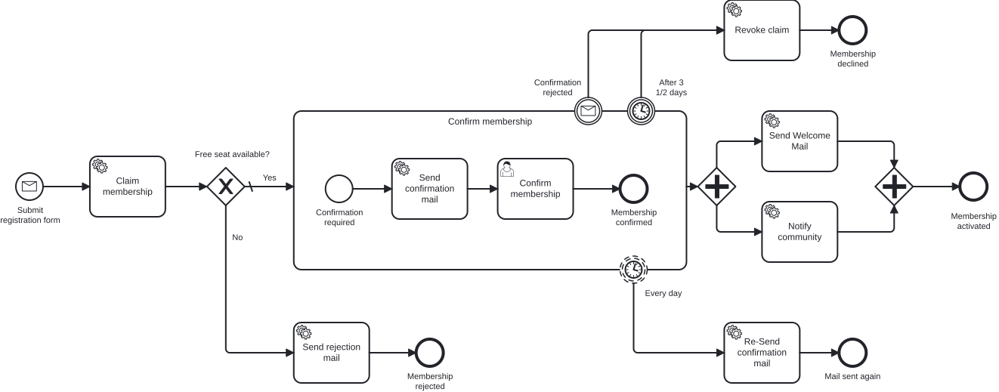

# Aufgabe 7 – Subprozess, Boundary Events und Parallelität

> **Voraussetzung:** Aufgabe 6 inklusive Add-on ist abgeschlossen – die Prozess-Tests laufen gegen die generierte Process-API.
> **Arbeitsverzeichnis:** `services/process-application`
> **Neu in dieser Aufgabe:** eingebetteter Subprozess, Timer Boundary Events (unterbrechend und nicht unterbrechend), Message Boundary Event, Parallel Gateway, ein Outbound-Adapter nach Microsoft Teams.

## Darum geht es

Miravelo stellt fest: Viele Bewerber bestätigen ihre Membership nie – und blockieren damit
Plätze, die andere gern hätten. Daraus werden drei Anforderungen:

1. **Täglich** eine Erinnerungsmail schicken, solange niemand bestätigt.
2. Nach **dreieinhalb Tagen** ohne Bestätigung die Membership automatisch abbrechen.
3. Bewerber können ihre Anmeldung **selbst zurückziehen**.

Und wer es bis zur Aktivierung schafft, soll gefeiert werden: Parallel zur Willkommens-Mail
geht eine Benachrichtigung in einen **Microsoft-Teams-Kanal** der Community. Beide Schritte
hängen nicht voneinander ab – ein Fall für ein **Parallel Gateway**.

## Lernziele

Nach dieser Aufgabe kannst du

- einen eingebetteten Subprozess modellieren und begründen, welche Aktivitäten er zusammenfasst,
- ein nicht unterbrechendes Timer Boundary Event für wiederkehrende Erinnerungen einsetzen,
- ein unterbrechendes Timer Boundary Event als Timeout einsetzen,
- ein Message Boundary Event von außen per Korrelation auslösen,
- zwei unabhängige Zweige über Parallel Gateways aufspannen und wieder zusammenführen,
- Transaktionsgrenzen an Boundary Events und Parallelzweigen richtig setzen,
- die neuen Pfade im Prozess-Test absichern.

## Ziel-Modell



Referenzmodell: `../../models/exercise-07/membership.bpmn`

## Aufgabe

### 1. Subprozess anlegen

Das gesamte Modell dieser Aufgabe baust und konfigurierst du im **Miragon BPMN Modeler**
(Element auswählen → Properties Panel), nicht im XML.

Fasse Bestätigungs-Mail und Bestätigung in einem eingebetteten Subprozess
`subProcess_confirmMembership` („Confirm membership") zusammen. Ein eingebetteter Subprozess
hat einen eigenen Start und ein eigenes Ende und enthält hier vier Elemente:

| Element | Typ | ID | Name |
|---|---|---|---|
| Start | None Start Event | `startEvent_confirmationRequired` | – |
| Bestätigungs-Mail | Service Task | `serviceTask_sendConfirmationMail` | Send confirmation mail |
| Bestätigung | User Task | `userTask_confirmMembership` | Confirm membership |
| Ende | None End Event | `endEvent_membershipConfirmed` | Membership confirmed |

Der Subprozess ist das Element, an das du im nächsten Schritt die Boundary Events anheftest.
Genau darum brauchst du ihn: Ein unterbrechendes Boundary Event bricht immer die Aktivität
ab, an der es hängt – und abgebrochen werden soll die **gesamte** Bestätigung, nicht nur ein
einzelner Task.

### 2. Boundary Events anhängen

Alle drei hängen an `subProcess_confirmMembership`:

| Element | Typ | ID | Name | Konfiguration |
|---|---|---|---|---|
| Erinnerung | Timer, **nicht** unterbrechend | `timer_resendEveryDay` | Every day | **Cycle** `R/P1D` (wiederholt sich täglich) |
| Timeout | Timer, unterbrechend | `timer_abortAfter3HalfDays` | After 3½ days | **Duration** `P3DT12H` (3½ Tage) |
| Rückzug | Message, unterbrechend | `event_confirmationRejected` | Confirmation rejected | Message: `Message_ConfirmationRejected` |

Achte auf den Unterschied: Die Erinnerung braucht einen **Cycle** (`R/…`), damit sie sich
wiederholt. Eine Duration würde nur einmal feuern.

### 3. Neue Tasks und End Events modellieren

Jedes Boundary Event braucht einen Pfad, der irgendwo endet. Die Erinnerung bekommt einen
eigenen kurzen Zweig, die beiden Abbruchwege teilen sich einen:

| Element | Typ | ID | Name | Konfiguration |
|---|---|---|---|---|
| Erinnerungsmail | Service Task | `serviceTask_reSendConfirmationMail` | Re-Send confirmation mail | `#{reSendConfirmationMailDelegate}` |
| Platz freigeben | Service Task | `serviceTask_revokeClaim` | Revoke claim | `#{revokeClaimDelegate}` |
| Ende Erinnerung | End Event | `endEvent_mailSentAgain` | Mail sent again | Ende des Erinnerungszweigs |
| Ende Abbruch | End Event | `endEvent_membershipDeclined` | Membership declined | nach `Revoke claim` |
| Ende Aktivierung | End Event | `endEvent_membershipActivated` | Membership activated | nach dem Join |

Beide unterbrechenden Boundary Events (`timer_abortAfter3HalfDays` und
`event_confirmationRejected`) führen auf `serviceTask_revokeClaim` und von dort auf
`endEvent_membershipDeclined`.

### 4. Parallel Gateway einsetzen

Zwischen dem Ende des Subprozesses und dem Aktivierungs-End-Event kommen zwei Parallel
Gateways:

| Element | Typ | ID | Zweige |
|---|---|---|---|
| Fork | Parallel Gateway | `gateway_notifyFork` | → `serviceTask_sendWelcomeMail`, → `serviceTask_notifyCommunity` |
| Join | Parallel Gateway | `gateway_notifyJoin` | ← beide Zweige, → `endEvent_membershipActivated` |

Der neue Service Task `serviceTask_notifyCommunity` („Notify community") bindet den
Delegate `#{notifyCommunityDelegate}`. Weil der Join **beide** Zweige abwartet, gilt die
Membership erst als aktiviert, wenn Mail **und** Benachrichtigung durch sind.

### 5. Transaktionsgrenzen ergänzen

Nach demselben Prinzip wie in [Aufgabe 5](exercise-05.md):

| Marker | Element | Warum |
|---|---|---|
| `asyncAfter` | `timer_resendEveryDay` | die Erinnerung läuft in eigener Transaktion und wiederholt sich, ohne den wartenden Subprozess zu berühren |
| `asyncAfter` | `timer_abortAfter3HalfDays` | saubere Grenze **vor** dem Abbruch (und ab Aufgabe 8 vor der Kompensation) |
| `asyncAfter` | `event_confirmationRejected` | dito für den nutzerseitigen Rückzug |
| `asyncBefore` | `serviceTask_reSendConfirmationMail` | externer Effekt – wie alle Mail-Tasks |
| `asyncBefore` | `serviceTask_sendWelcomeMail` | eigener Commit pro Parallelzweig |
| `asyncBefore` | `serviceTask_notifyCommunity` | eigener Commit pro Parallelzweig |

**Warum je Zweig eine eigene Grenze?** Ohne Marker liegen `sendWelcomeMail` und
`notifyCommunity` in **einer** Transaktion. Scheitert der Teams-Aufruf, rollt die Engine
den Job zurück und wiederholt ihn – die Willkommens-Mail wäre dann schon raus und ginge
**erneut** an dieselbe Adresse.

### 6. Use Cases und Delegates ergänzen

- **`ReSendConfirmationMailUseCase` / `ReSendConfirmationMailService`** – logget das
  erneute Verschicken der Bestätigungs-Mail.
- **`RevokeClaimUseCase` / `RevokeClaimService`** – logget die Freigabe und gibt den
  Kapazitätsplatz wieder frei.
- **`ReSendConfirmationMailDelegate` / `RevokeClaimDelegate`** – analog zu den bestehenden
  Delegates.

### 7. Rückzug per REST auslösen

Das Message Boundary Event wird von außen ausgelöst. Ergänze den Endpunkt

```
POST /api/memberships/{membershipId}/reject
```

und korreliere im `MembershipProcessAdapter` mit
`runtimeService.createMessageCorrelation(...)`: Message-Name aus dem Modell, gefiltert auf
die Prozessvariable `membershipId`.

### 8. Community-Benachrichtigung anbinden

Die Benachrichtigung läuft komplett in der Engine – ein gewöhnlicher Delegate:

- `adapter/inbound/operaton/NotifyCommunityDelegate` – liest `membershipId`, ruft den Use Case.
- `application/port/inbound/NotifyCommunityUseCase` + `application/service/NotifyCommunityService` –
  lädt die Membership, baut eine `Notification` (Titel und Text) und reicht sie an den Out-Port.
- `application/port/outbound/NotificationPublisherOutPort` +
  `adapter/outbound/teams/MicrosoftTeamsMessagePublisher` – postet die Benachrichtigung als
  **Adaptive Card** in einen Teams-Kanal (Webhook aus Power-Automate-*Workflows*).
- `domain/Notification` – ein Record mit `title` und `text`.

Aufbau der Adaptive Card und der REST-Aufruf sind Infrastruktur: Übernimm sie aus der
Referenzlösung. Den `RestClient` stellt `adapter/config/RestClientConfig` bereit. Die
Ziel-URL steht in der `application.yaml`:

```yaml
notification:
  teams:
    # Echte URL per Umgebungsvariable TEAMS_WEBHOOK_URL – kein Secret ins Repository.
    webhook-url: ${TEAMS_WEBHOOK_URL:https://CHANGE-ME}
```

### 9. Prozess-Test erweitern

Dein Test deckt bisher Happy Path und Ablehnung wegen fehlender Kapazität ab. Ergänze drei
Tests:

- **Timeout (unterbrechend):** Warte am User Task, feuere den Timer mit dem Helfer
  `fireTimer(processEngine, Elements.TIMER_ABORT_AFTER_3_HALF_DAYS.getValue())`, führe die
  offenen Jobs aus und prüfe
  `hasPassed(Elements.SERVICE_TASK_REVOKE_CLAIM.getValue(), Elements.END_EVENT_MEMBERSHIP_DECLINED.getValue())`.
  Mocke dafür `RevokeClaimUseCase`.
- **Rückzug per Nachricht:** Statt des Timers `membershipProcess.rejectMembership(id)`
  aufrufen – gleicher Ausgang.
- **Erinnerung (nicht unterbrechend):**
  `fireTimer(..., Elements.TIMER_RESEND_EVERY_DAY.getValue())`, dann prüfen, dass
  `reSendConfirmationMailUseCase` ein **zweites** Mal aufgerufen wurde und der Prozess
  weiterhin am User Task wartet. Mocke `ReSendConfirmationMailUseCase`.

Den `fireTimer`-Helfer (führt einen Timer-Job unabhängig vom Fälligkeitsdatum aus) findest
du in `ProcessEngineTestUtils`.

## Randbedingungen

- Die Timer im Referenzmodell tragen die **fachlichen** Werte (`R/P1D` und `P3DT12H`). Wenn
  du das Verhalten manuell beobachten willst, setze sie vorübergehend auf `R/PT1M` und
  `PT3M` – im Prozess-Test brauchst du das nicht, dort löst du die Timer direkt aus.
- Die Element-IDs der Boundary Events folgen der gewachsenen Konvention `timer_` und
  `event_` statt `boundaryEvent_` – so steht es im Referenzmodell, und dabei bleibt es.
- Neue Element-IDs erscheinen nach dem nächsten `generate-sources` automatisch als
  `Elements.*`-Konstanten.
- Mocke im Test auch `NotifyCommunityUseCase`, damit kein echter Teams-Aufruf hinausgeht.
- Committe niemals eine echte Webhook-URL – sie kommt aus `TEAMS_WEBHOOK_URL`.

## Erwartetes Ergebnis

Lege eine Membership an und merke dir die zurückgegebene ID – über sie löst du gleich den
Rückzug aus:

```bash
MEMBERSHIP_ID=$(curl -s -X POST http://localhost:8080/api/memberships \
  -H "Content-Type: application/json" \
  -d '{"email": "eve@miravelo.com", "name": "Eve", "age": 26}')

# Mit verkürzten Timern: nach einer Minute erscheint die Erinnerungsmail im Log,
# der User Task wartet unverändert weiter

curl -X POST http://localhost:8080/api/memberships/$MEMBERSHIP_ID/reject
# → Revoke claim läuft, die Instanz endet an "Membership declined"
```

Ohne Rückzug bricht der Prozess nach Ablauf des Timeout-Timers selbst ab. Wird der User Task
dagegen bestätigt, laufen beide Parallelzweige und die Instanz endet an
`Membership activated`.

## Selbstcheck

- [ ] Der Subprozess enthält Start Event, beide Tasks und End Event
- [ ] Alle drei Boundary Events hängen am Subprozess, die Unterbrechungs-Semantik stimmt
- [ ] Beide unterbrechenden Pfade führen über `Revoke claim` zu `Membership declined`
- [ ] Fork und Join sind Parallel Gateways, beide Zweige tragen `asyncBefore`
- [ ] `POST /api/memberships/{id}/reject` bricht eine wartende Instanz ab
- [ ] Die drei neuen Prozess-Tests sind grün

## Hinweise

Dass die Teams-Anbindung mitten in der Prozessanwendung sitzt, ist bewusst noch nicht
ideal. In [Aufgabe 10](exercise-10.md) siehst du das Gegenmodell: ein eigener Service, der
seinen Prozess besitzt – inklusive Isolation seiner Secrets. Für jetzt reicht der Delegate.

## Referenzlösung

`../../solutions/exercise-07/` – oder direkt laden:

```bash
./mvnw -pl services/process-application antrun:run@load-solution -Dsolution=07
```

## Nächster Schritt

`revokeClaim` hängt aktuell als expliziter Task an jedem Abbruchpfad. In Aufgabe 8 überlässt
du das der Engine.

➡️ [Weiter zu Aufgabe 8](exercise-08.md)
