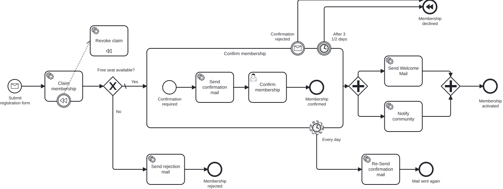

# Aufgabe 8 – Kompensation (SAGA-Muster)

> **Voraussetzung:** Aufgabe 7 ist abgeschlossen – Subprozess, Boundary Events und Parallelzweige laufen.
> **Arbeitsverzeichnis:** `services/process-application`
> **Neu in dieser Aufgabe:** Compensation Boundary Event, Kompensations-Handler, Compensating End Event, SAGA-Denkweise.

## Darum geht es

Erinnerst du dich an `revokeClaim`? In Aufgabe 7 liegt dieser Service Task im **Sequenzfluss**
jedes Abbruchpfads und gibt den reservierten Platz wieder frei. Das war pragmatisch – und es
skaliert schlecht.

Sobald mehrere Aktivitäten zurückgenommen werden müssen (Reservierung, Bestätigungs-Mail,
Aufrufe an Drittdienste), wächst dieser Rücknahmepfad in **jedem** Sequenzfluss mit, der zu
einem Abbruch führt. Man kopiert dieselbe Folge von Service Tasks an jedes Abbruch-End-Event –
und vergisst sie beim nächsten neuen Pfad.

**BPMN-Kompensation** dreht das um: Der Prozess deklariert **einmal**, welche Aktivität
(`revokeClaim`) welche andere Aktivität (`claimMembership`) rückgängig macht. Wird ein
Compensating End Event erreicht, ruft die Engine diesen Kompensations-Handler von sich aus
auf – ganz ohne Sequenzfluss.

## Lernziele

Nach dieser Aufgabe kannst du

- ein Compensation Boundary Event an einen Service Task hängen,
- einen Task als Kompensations-Handler markieren (`isForCompensation`) und per Association
  zuordnen,
- ein End Event in ein Compensating End Event umwandeln,
- Kompensation von einem Transaktions-Rollback unterscheiden,
- das SAGA-Muster in einem Prozessmodell wiedererkennen.

## Ziel-Modell



Referenzmodell: `../../models/exercise-08/membership.bpmn`

## Aufgabe

### 1. Kompensations-Handler deklarieren

Zuerst sagst du dem Modell, *was* die Reservierung rückgängig macht. Dazu gehören drei
Dinge: ein Compensation Boundary Event am reservierenden Task, der Handler selbst und die
Association, die beide verbindet.

Alle drei modellierst und konfigurierst du im **Miragon BPMN Modeler** (Element auswählen →
Properties Panel), nicht im XML.

| Element | Typ | ID | Konfiguration |
|---|---|---|---|
| Kompensations-Boundary | Compensation Boundary Event | `boundary_compensateClaim` | hängt an `serviceTask_claimMembership` |
| Verknüpfung | Association | `association_compensateClaim` | vom Boundary auf `serviceTask_revokeClaim` |
| Handler | Service Task | `serviceTask_revokeClaim` | `isForCompensation="true"`, Delegate bleibt `#{revokeClaimDelegate}` |

Der Handler liegt damit **außerhalb** des Sequenzflusses: kein eingehender, kein
ausgehender Flow.

### 2. Abbruchpfade entkoppeln

Verbinde `timer_abortAfter3HalfDays` und `event_confirmationRejected` **direkt** mit
`endEvent_membershipDeclined`. Der Service Task `serviceTask_revokeClaim` fällt damit aus
beiden Sequenzflüssen heraus.

### 3. End Event zum Auslöser machen

Wandle `endEvent_membershipDeclined` in ein **Compensating End Event** um. Erst dadurch
löst der Abbruch die Kompensation aus.

## Randbedingungen

- **Am Java-Code ändert sich nichts.** `RevokeClaimDelegate` bleibt unverändert – er wird
  nur anders aufgerufen: von der Engine als Kompensations-Handler statt über einen
  Sequenzfluss.
- Alle übrigen Elemente (Subprozess, Timer, Parallelzweige, Ablehnung wegen fehlender
  Kapazität) bleiben unangetastet.
- Für den manuellen Test lohnt es sich, die Timer-Dauer vorübergehend auf `PT30S` zu setzen.

## Erwartetes Ergebnis

**Abbruch durch Timeout:**

1. `POST /api/memberships` – eine Prozessinstanz startet und reserviert einen Platz.
2. Warte, bis das Timer Boundary Event feuert.
3. Im Log erscheint die Freigabe (`Revoking membership claim for …`) – obwohl kein
   expliziter Task mehr im Pfad liegt.
4. Im Cockpit endet die Instanz an „Membership declined".

**Abbruch durch Rückzug:**

1. `POST /api/memberships`, dann warten, bis der User Task `Confirm membership` steht.
2. `POST /api/memberships/{membershipId}/reject` – das Message Boundary Event feuert.
3. Der Pfad geht direkt zum Compensating End Event, die Engine ruft `revokeClaim` auf.

## Selbstcheck

- [ ] `serviceTask_revokeClaim` liegt **nirgends** mehr im Sequenzfluss
- [ ] Der Task trägt `isForCompensation="true"` und ist per Association mit dem Boundary
      Event an `claimMembership` verknüpft
- [ ] `endEvent_membershipDeclined` ist ein Compensating End Event
- [ ] Die Freigabe wird bei Timeout **und** bei Rückzug ausgelöst
- [ ] Im Cockpit ist der Kompensations-Handler in der Prozesshistorie sichtbar
- [ ] Der Prozess-Test aus Aufgabe 7 läuft unverändert grün

## Hinweise

**Kontrollfrage:** Warum funktioniert `RevokeClaimDelegate` ohne Änderung weiter, obwohl er
nicht mehr im Sequenzfluss liegt? (Antwort: Der Delegate ist an das *Element* gebunden, nicht
an dessen Position im Fluss. Die Engine erzeugt für den Handler eine eigene Execution mit
denselben Prozessvariablen.)

**Kompensation ist kein Rollback.** Das technische Rollback aus dem Trainingskapitel
*Async & Transaction Boundaries* macht eine *einzelne, noch nicht committete*
Engine-Transaktion rückgängig – automatisch und unsichtbar. Kompensation ist das fachliche
Gegenstück: Sie macht *bereits committete* Arbeit über **neue** Transaktionen rückgängig,
lange nachdem der Wait State passiert ist. Kurz: Rollback greift *vor* dem Commit,
Kompensation *danach*.

**Warum dein Prozess-Test unverändert bleibt:** Fachlich ändert sich am Ergebnis nichts –
`serviceTask_revokeClaim` läuft weiterhin, nur als Handler. Deine Assertions
`hasPassed(Elements.SERVICE_TASK_REVOKE_CLAIM.getValue(), Elements.END_EVENT_MEMBERSHIP_DECLINED.getValue())`
und `verify(revokeClaimUseCase).revokeClaim(id)` gelten weiter. Genau das ist ein gutes
Zeichen: Ein Umbau der Modellierung, der das Verhalten nicht ändert, darf den Test nicht
brechen.

**Weiterführend:** Kompensation ist das BPMN-Werkzeug für **SAGA-Muster** in verteilten
Systemen – jeder Schritt bekommt einen Kompensationsschritt, und bei einem Fehler
kompensiert die Engine die erfolgreichen Schritte in umgekehrter Reihenfolge. In Operaton
funktioniert das auch über Subprozessgrenzen hinweg.

## Referenzlösung

`../../solutions/exercise-08/` – oder direkt laden:

```bash
./mvnw -pl services/process-application antrun:run@load-solution -Dsolution=08
```

## Nächster Schritt

In Aufgabe 9 wandert die gesamte Ablehnungsbehandlung in einen eigenen Prozess – aufgerufen
über eine Call Activity und gesteuert von einer DMN-Entscheidungstabelle.

➡️ [Weiter zu Aufgabe 9](exercise-09.md)
