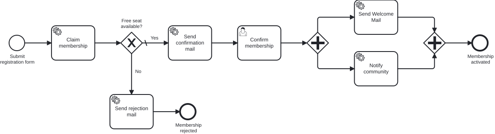

# Exercise 0 – Model the membership flow at the business level

> **Prerequisite:** Chapter 1 – you know BPMN as a notation: Start and End Events, User Task and Service Task, sequence flow, Exclusive Gateway and Parallel Gateway.
> **Working directory:** any folder you like (no code yet, no module yet).
> **New in this exercise:** BPMN modeler, the membership core flow as a shared map.

## What this is about

**Miravelo** is an online shop for premium bikes – gravel bikes for long weekend
tours, road bikes for everyone who likes to move fast on the asphalt. The customers
are young, brand-conscious and pretty passionate.

Miravelo turns this into more than a mailing list: the **Inner Circle**, an exclusive
membership with a limited number of seats. Whoever wants to join registers, gets a seat
reserved, confirms via double opt-in – and is welcomed in the end. Sounds like a handful of
steps, but it has a capacity limit and (later) confirmation deadlines and a fallback for when
there is no free seat after all.

> *"Let's sketch this out before anyone starts coding."*
> — the one sensible sentence in the whole kickoff.

Before anything gets automated, you capture the **core flow at the business level**: what happens,
in what order, where does the flow wait, where does it branch? This is the language in which the
business side and development reach agreement – without a single line of technology. This model is
the **starting point for the entire training**: from Exercise 1 on you automate it piece by piece,
and you add the exceptions once you know the BPMN shapes for them.

## Learning goals

After this exercise you can

- install a BPMN modeler and create an end-to-end model in it,
- apply the notation from Chapter 1 to a real business process – Start and End Events, User Task
  and Service Task, Exclusive Gateway and Parallel Gateway,
- justify the waiting and branching points in the flow (where does the flow wait for a human, where
  does a condition decide),
- name elements so the business side can read the flow out loud without follow-up questions.

## Target model

This is the core flow of the Inner Circle – built only from shapes you know from Chapter 1. This is
exactly the flow you rebuild technically, step by step, over the course of the training, extending
it later with the exceptions.

## The task

### 1. Install the modeler in your IDE

We model straight inside the IDE – no separate app needed. Install the **Miragon BPMN Modeler**
as a [VS Code extension](https://marketplace.visualstudio.com/items?itemName=miragon-gmbh.vs-code-bpmn-modeler)
or as an [IntelliJ plugin](https://plugins.jetbrains.com/plugin/32634-miragon-bpmn-modeler).
Whichever IDE you pick, it is the same modeler – so every following exercise opens the model in a
real modeler. Without VS Code or IntelliJ, use the
[standalone desktop app](https://miragon.github.io/bpmn-modeler/) as a fallback. Then create a new
BPMN diagram.

### 2. Model registration and capacity check

Start with the backbone of the process: a prospect registers, the flow reserves a seat and then
checks whether one is free at all. If none is free, the application ends with a rejection.

| Type | Name |
|---|---|
| Start Event | Submit registration form |
| Service Task | Claim membership |
| Exclusive Gateway | Free seat available? |
| Service Task | Send rejection mail |
| End Event | Membership rejected |

Connect Start → *Claim membership* → *Free seat available?*. From the gateway the **No** path leads
to *Send rejection mail* → *Membership rejected*. The **Yes** path stays open for now – you fill it
in the next step.

### 3. Model the confirmation

Whoever gets a seat has to actively confirm the membership (double opt-in). Model the **Yes** path
of the gateway from step 2 as two consecutive steps: first a confirmation mail goes out, then the
prospect confirms.

| Type | Name |
|---|---|
| Service Task | Send confirmation mail |
| User Task | Confirm membership |

At this *User Task* the flow stops: here it waits until a human confirms. The *Service Task* before
it runs on its own – a system sends the mail.

### 4. Model the activation in parallel

Once the membership is confirmed, the member is activated – and two things happen at once: the
welcome mail goes out, and the community is notified. Model this with a **Parallel Gateway** (fork
and join). Close the fork with a parallel join of the same type (AND with AND), so both branches are
synchronised again before you reach *Membership activated*.

| Type | Name |
|---|---|
| Parallel Gateway (fork) | – |
| Service Task | Send Welcome Mail |
| Service Task | Notify community |
| Parallel Gateway (join) | – |
| End Event | Membership activated |

Route the exit of *Confirm membership* into the fork, both service tasks in parallel, then into the
join and to *Membership activated*.

### 5. Save the model

Save the file as `membership.bpmn` in a folder of your choice. It is your reference picture for all
the exercises that follow.

## Constraints

- **Business level only.** This is about flow and naming. Element IDs by convention, form fields,
  wiring service tasks to Java code as well as `isExecutable` and `historyTimeToLive` are
  deliberately left out here – that comes from Exercise 2 on.
- **Only what you know from Chapter 1.** The flow uses exclusively Start and End Events, User Task
  and Service Task, Exclusive Gateway and Parallel Gateway. Advanced shapes like a subprocess,
  boundary events or compensation come only in later exercises – leave them out here.
- **Model it clean, not just complete.** Apply the modelling rules from Chapter 1: name every
  activity as a verb plus object (*Claim membership*), every gateway as a question and every
  outgoing sequence flow as the answer (*Yes* / *No*). Frame the flow with Start and End Events and
  give each End Event its own name. Keep the happy path – registration, confirmation, activation –
  on a straight line from left to right, and route the rejection away below without crossing flows.
  Branch only at gateways: fork and join are separate diamonds.
- **This is the starting point, not the final picture.** The exceptions – confirmation deadlines, a
  daily reminder, an active rejection and undoing a reserved seat – are added in later exercises.
- **Don't copy it into the module yet.** Under `services/process-application/src/main/resources/bpmn/`
  there is already a deliberately rudimentary `membership.bpmn` that you need in Exercise 1.
  Don't overwrite it now.
- Model names are English throughout; the task descriptions are available in German and English.

## Expected result

Your model captures the core flow: registration, seat reservation, the capacity check at the
Exclusive Gateway with the rejection, the confirmation with its waiting User Task and the parallel
activation. The modeler reports no errors, and someone from the business side could read the flow
out loud without asking what a single element means.

## Self-check

- [ ] The flow is framed with Start and End Events: it starts at *Submit registration form* and
      ends in exactly one named End Event per outcome – *Membership activated* or *Membership
      rejected*
- [ ] Every activity is named as a verb plus object, the Exclusive Gateway as a question
      (*Free seat available?*) and its outgoing sequence flows as the answer (*Yes* / *No*)
- [ ] Capacity is checked via an Exclusive Gateway with a **No** path to the rejection
- [ ] The confirmation consists of the Service Task *Send confirmation mail* and the User Task
      *Confirm membership*, where the flow waits for a human
- [ ] The activation runs through a Parallel Gateway; the fork is closed with a parallel join of
      the same type that waits for both branches (welcome mail and community notification run at the
      same time)
- [ ] The happy path runs straight from left to right; the rejection path branches away without
      crossing flows, and no gateway merges and splits at once (fork and join are separate diamonds)
- [ ] You walked both paths once by hand: happy path and rejection each end in exactly one named
      End Event; no branch runs into nothing
- [ ] You can say in one sentence each where the flow waits for a human (at the User Task) and why
      the Exclusive Gateway branches
- [ ] All elements are connected via sequence flows – no dangling element
- [ ] The file is saved as `membership.bpmn`

## Hints

The flow grows over the course of the training. The exceptions get their **own exercise** later,
where you add them at the business and technical level: the confirmation step in Exercise 4, the
capacity gateway with its condition in Exercise 5, the deadlines, the reminder and the active
rejection (with boundary events) in Exercise 7, and undoing a reserved seat (compensation) in
Exercise 8. Here you first model the core flow, so that at every partial step you know where it
belongs.

Why a User Task and a Service Task? The **User Task** waits for a human – someone confirms the
membership. The **Service Task** is handled by a system – the mail dispatch, the seat reservation.
This distinction defines where the flow waits and where it continues on its own. By the way, the
three mails are **Service Tasks**, not Send Tasks – a system handles them (from Exercise 3 on you
implement them as a JavaDelegate). Manual Task, Business Rule Task, Script Task and the remaining
task types from Chapter 1 only appear later or stay out entirely.

**Why no pools, lanes or data objects?** The whole flow runs inside Miravelo, with a single human
touchpoint – the User Task *Confirm membership*; every other step is a Service Task. Following the
'lanes with discipline' rule a System gets no lane of its own, and a single participant needs
neither a Pool nor a Lane – both would only fill this map with noise. Data objects are purely
descriptive; the engine does not evaluate them, so we deliberately leave them out here and focus on
flow and naming.

## Reference solution

`../../models/exercise-00/membership.bpmn` – open the model in the modeler and compare it with
yours.

## Next step

In Exercise 1 you get the engine running that executes exactly these kinds of models – starting
with a deliberately tiny excerpt.

➡️ [Next: Exercise 1](exercise-01.md)
