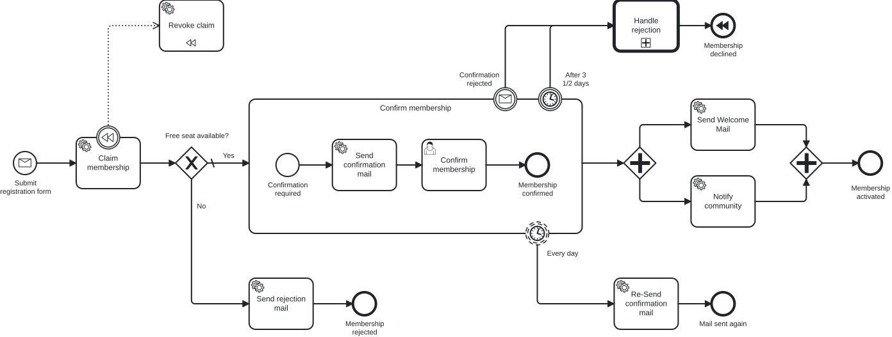

# Exercise 9 – Call Activity and DMN decision

> **Prerequisite:** Exercise 8 is complete – the main process knows the compensation boundary on `serviceTask_claimMembership`.
> **Working directory:** `services/process-application`
> **New in this exercise:** a standalone process, a Call Activity with variable mapping, a DMN decision table, a Business Rule Task.

## What this is about

Compensation runs cleanly: when a membership is rejected, the engine releases the spot again on its own. But Miravelo has learned something.

Some of these crisis aspirants between 21 and 29 are far too valuable to just let go. They earn well, they're right in the middle of their quarter-life crisis, and they're looking for exactly what Miravelo offers. Someone needs to win them back personally.

So that the main process doesn't get bloated by this, the entire rejection handling moves into its **own process**, invoked by a **Call Activity**. Who the target group is isn't decided by an `if` cascade in code, but by a **DMN decision table** – one the business side can adjust themselves later.

> You could also solve this with an embedded subprocess. We take the Call Activity because we want to get to know its particulars: its own process definition, its own instance, explicit variable mapping.

## Learning goals

After this exercise you can

- extract part of a process into its own process definition,
- invoke it via a Call Activity and pass variables through an in-mapping,
- model, deploy, and evaluate a DMN decision table via a Business Rule Task,
- branch on a decision's result at an Exclusive Gateway,
- account for the difference between the main and the called process instance in your test.

## Target model

Main process:



Called process `handleRejection`:


Reference models: `../../models/exercise-09/membership.bpmn`,
`../../models/exercise-09/membership-rejection.bpmn`,
`../../models/exercise-09/categorize-applicant.dmn`

## The task

### 1. Model the DMN decision table

The new rejection process makes a business decision: which of the rejected applicants is high value and thus worth a personal reacquisition attempt? You model this decision as a DMN decision table – your first one. That way you get to know the DMN editor, the hit policy, and the FEEL range notation. You have two options:

- **Model it yourself (recommended):** In a DMN modeler, create the new file `src/main/resources/dmn/categorize-applicant.dmn` and build the table from the specification below.
- **Fallback – copy the finished model:** If you want to skip the DMN editor, copy the reference model into the module:

  ```bash
  cp models/exercise-09/categorize-applicant.dmn \
     services/process-application/src/main/resources/dmn/categorize-applicant.dmn
  ```

The specification for the model-it-yourself path – the IDs and types have to match exactly so that the Business Rule Task in step 2 finds the decision:

| Property | Value |
|---|---|
| Decision ID | `categorizeApplicant` |
| Hit Policy | `FIRST` |
| Input | `age` (integer) |
| Output | `isHighValue` (boolean) |
| Rule | Age in range `[21..29]` → `true`; default `-` → `false` |

The FEEL range `[21..29]` is inclusive on both ends (21 and 29 are included). Just like the BPMN files, all `*.dmn` files under `src/main/resources` are deployed automatically at start-up.

### 2. Model the process `membership-rejection.bpmn`

**New file:** `src/main/resources/bpmn/membership-rejection.bpmn`, process key `handleRejection`.

You set all the attributes below in the **Miragon BPMN Modeler** (select the element →
Properties Panel), not in the XML.

| Element | Type | ID | Name | Configuration |
|---|---|---|---|---|
| Start | None Start Event | `startEvent_confirmationRejected` | Confirmation rejected | – |
| Categorization | Business Rule Task | `serviceTask_categorizeApplicant` | Categorize applicant | Decision Ref `categorizeApplicant`, Result Variable `isHighValue`, Map Decision Result `singleEntry` |
| Branch | Exclusive Gateway | `gateway_highValue` | High value? | Default flow: no-path |
| Personal contact | User Task | `userTask_writeRegretMail` | Write an email expressing regret | `asyncAfter="true"` |
| End of yes-path | End Event | `endEvent_triedToReacquire` | Tried to reaquire applicant | – |
| End of no-path | End Event | `endEvent_acceptRejection` | Accept rejection | – |

Condition on the yes-path: `${isHighValue}`. The no-path is the default flow.

> In the reference model the Business Rule Task carries the prefix `serviceTask_` instead of `businessRuleTask_`. That's for historical reasons – take the ID from the reference model so that the docs, model, and generated constants match up.

### 3. Use the Call Activity in the main process

In the main process, a single element replaces all the previous abort steps. The Call Activity points via its *Called Element* attribute to the process key of the called process:

| Element | Type | ID | Name | Configuration |
|---|---|---|---|---|
| Rejection handling | Call Activity | `callActivity_handleRejection` | Handle rejection | Called Element: `handleRejection` |

- Incoming flows: from `timer_abortAfter3HalfDays` and from `event_confirmationRejected`
- Outgoing flow: to `endEvent_membershipDeclined` (the Compensating End Event from Exercise 8)

The compensation stays untouched: after returning from the Call Activity, the Compensating End Event fires, and the engine invokes `serviceTask_revokeClaim`.

### 4. Pass variables

You create the variable mapping in the **Miragon BPMN Modeler**, not directly in the XML:
select the Call Activity → Properties Panel → **In Mapping** section → add one *source/target*
pair each for `membershipId` and `age` (main process → called process). In the XML this
produces an `extensionElements` block with `camunda:in` entries on the Call Activity:

```xml
<bpmn:extensionElements>
  <camunda:in source="membershipId" target="membershipId" />
  <camunda:in source="age" target="age" />
</bpmn:extensionElements>
```

`age` is the input of the DMN decision – without the mapping, the table runs on empty. You don't need an out-mapping here: the main process doesn't process any result.

### 5. Extend the process test

Rejection handling now lives in the Call Activity. Add both DMN branches:

- **Age outside 21–29** (for example `40`): after a timeout or withdrawal, the Call Activity runs through without a wait state, and then compensation kicks in. Check
  `hasPassed(Elements.CALL_ACTIVITY_HANDLE_REJECTION.getValue(), Elements.SERVICE_TASK_REVOKE_CLAIM.getValue(), Elements.END_EVENT_MEMBERSHIP_DECLINED.getValue())`.
- **Age between 21 and 29:** the called process waits at `userTask_writeRegretMail`. Because the element lives in the **called** process, its constant comes from the second generated API: fetch the task via
  `taskDefinitionKey(HandleRejectionProcessApi.Elements.USER_TASK_WRITE_REGRET_MAIL.getValue())`,
  complete it, run the open jobs, and check the same completion.

## Constraints

- The called process runs as its **own process instance**. Assertions on the main instance only see the main instance's activities – including the Call Activity itself, not its internals.
- `mapDecisionResult=singleEntry` only works as long as the table matches exactly one row with exactly one output column. For multiple matches you need a different mapping strategy.
- The compensation logic from Exercise 8 stays in the main process; the Call Activity sits **between** the abort boundary events and the Compensating End Event.
- `POST /api/memberships` returns the membership ID as **plain text**, not as JSON – which is why there's no `jq` below.

## Expected result

Check both branches of the decision table by rejecting two sign-ups with different ages.

**Rejection outside the target group:**

```bash
MEMBERSHIP_ID=$(curl -s -X POST http://localhost:8080/api/memberships \
  -H "Content-Type: application/json" \
  -d '{"email": "grace@miravelo.com", "name": "Grace", "age": 35}')

curl -X POST http://localhost:8080/api/memberships/$MEMBERSHIP_ID/reject
```

In the Cockpit: the main instance sits at the Call Activity `callActivity_handleRejection`, while an **own process instance** of `handleRejection` runs through. The Business Rule Task evaluates the DMN, `isHighValue` is `false`, the Exclusive Gateway takes the default flow, and the called instance ends at *Accept rejection*. Back in the main instance, the Compensating End Event fires, and the log shows the spot being released.

**Rejection within the target group:**

```bash
MEMBERSHIP_ID=$(curl -s -X POST http://localhost:8080/api/memberships \
  -H "Content-Type: application/json" \
  -d '{"email": "hanna@miravelo.com", "name": "Hanna", "age": 25}')

curl -X POST http://localhost:8080/api/memberships/$MEMBERSHIP_ID/reject
```

This time the DMN returns `isHighValue = true`, and the User Task *Write an email expressing regret* appears in the tasklist. After completing it, the called process ends at *Tried to reaquire applicant*, and the main process compensates as before.

## Self-check

- [ ] `handleRejection` is its own file and shows up in the Cockpit as its own process definition
- [ ] The DMN lives under `src/main/resources/dmn/` and is deployed at start-up
- [ ] The Call Activity passes `membershipId` **and** `age` via in-mapping
- [ ] Age 21–29 leads to the User Task, any other age goes straight to the End Event
- [ ] After returning from the Call Activity, the Compensating End Event triggers `revokeClaim`
- [ ] Both new test cases are green

## Reference solution

`../../solutions/exercise-09/` – or load it directly:

```bash
./mvnw -pl services/process-application antrun:run@load-solution -Dsolution=09
```

## Next step

In Exercise 10 you leave the single module behind: another department gets its own service – and its own process on the same engine.

➡️ [Next: Exercise 10](exercise-10.md)
