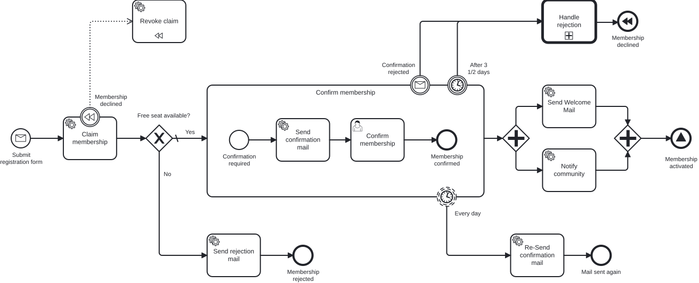

# Extra Task 1 – Breaking Free from Engine Lock-in

> **Prerequisite:** Exercise 10 is complete – the Membership process runs end to end, including the "Membership activated" signal end event.
> **Working directory:** `services/process-application`
> **New in this exercise:** Process-Engine-API from bpm-crafters, worker pattern instead of JavaDelegate, engine-neutral outbound adapter, ArchUnit guardrail.

## What this is about

**Strategy meeting. The process is running. Someone asks the uncomfortable question.**

> *"Great that everything works. But we've stapled our entire business logic to a single engine.
> What happens if we have to switch in two years?"*
> — The person who has lived through a migration before.

Camunda 7 is end-of-life, so we moved to **Operaton** – a maintained fork,
a solid choice. But our code knows this a little *too* well: every service task hangs off a
`JavaDelegate` with `org.operaton.bpm.engine.delegate.DelegateExecution`, and the
process adapter calls `RuntimeService` directly. Switching to Camunda 8 or yet another engine
would mean touching every delegate and every engine call.

The [**Process-Engine-API**](https://github.com/bpm-crafters/process-engine-api) from
bpm-crafters is an engine-neutral abstraction layer – the way JPA abstracts the database.
It ships adapters for various BPMN engines (Operaton, Camunda 7,
Camunda 8, CIB Seven). With it, an engine switch becomes – greatly simplified – a **swap of one
adapter**. Never quite that simple in reality, but far simpler than otherwise.

The best part: **domain, application services, and ports stay untouched.** They were
always engine-neutral – that's exactly what hexagonal architecture is for. You only touch
the adapter layer.

## Learning goals

After this exercise you can

- point out where native engine coupling creeps into the code (`JavaDelegate`, `DelegateExecution`,
  `RuntimeService`),
- wire up service tasks via the worker pattern (`@ProcessEngineWorker`) instead of
  `DelegateExpression`,
- start processes and correlate messages engine-neutrally (`StartProcessApi`,
  `CorrelationApi`),
- explain why external tasks make the `asyncBefore` markers unnecessary,
- guarantee via an architecture test that no `org.operaton.bpm` import leaks into the code anymore.

## Target model

The process model does **not change functionally**. It is exactly the process from Exercise 10 –
only the technical wiring of the service tasks changes. The "Membership
activated" signal end event stays a native BPMN throw without a delegate and therefore fits into the
engine-neutral world anyway.

Main process:



Called process `handleRejection`:


What changes – and what doesn't:

| Layer | Exercise 10 (native Operaton) | Extra Task 1 |
|---|---|---|
| `domain/`, `application/` | unchanged | **unchanged** |
| Inbound service tasks | `JavaDelegate` + `DelegateExecution` | `@ProcessEngineWorker` worker |
| Outbound process adapter | `RuntimeService.createMessageCorrelation(...)` | `StartProcessApi` / `CorrelationApi` |
| BPMN service tasks | `operaton:delegateExpression="#{xDelegate}"` | `operaton:type="external"` + `operaton:topic` |
| Bootstrap | `@EnableProcessApplication` | gone – the adapter takes over deployment and workers |

Message start, boundary events, subprocess, call activity, DMN, and compensation stay
structurally the same. DMN and user tasks still run inside the engine; they need no workers.

## The task

> The easiest path is to copy your Exercise 10 solution and refactor it step by step.
> The logistics service from Exercise 10 stays **unchanged** and is not part of this
> exercise.

### 1. Add the dependencies

To the module's `pom.xml`:

- `dev.bpm-crafters.process-engine-api:process-engine-api`
- `dev.bpm-crafters.process-engine-worker:process-engine-worker-spring-boot-starter`
- `dev.bpm-crafters.process-engine-adapters:process-engine-adapter-operaton-embedded-spring-boot-starter`

The Operaton-embedded adapter is exactly the dependency you would swap for
a different adapter when switching engines – workers and ports stay as they are.

### 2. Switch service tasks to external tasks

This too is modeling work in the **Miragon BPMN Modeler**, not in the XML: select the service
task → Properties Panel → set **Implementation** to **External** → set the topic → add an
input mapping under the **Input/Output** section so the worker gets the `membershipId`. From

```xml
<bpmn:serviceTask id="serviceTask_sendConfirmationMail" name="Send confirmation mail"
                  operaton:delegateExpression="#{sendConfirmationMailDelegate}">
```

this becomes an external task with a topic and input mapping – in the XML:

```xml
<bpmn:serviceTask id="serviceTask_sendConfirmationMail" name="Send confirmation mail"
                  operaton:type="external" operaton:topic="sendConfirmationMail">
  <bpmn:extensionElements>
    <operaton:inputOutput>
      <operaton:inputParameter name="membershipId">${membershipId}</operaton:inputParameter>
    </operaton:inputOutput>
  </bpmn:extensionElements>
```

Switch all seven service tasks: `claimMembership`, `sendConfirmationMail`,
`sendWelcomeMail`, `sendRejectionMail`, `reSendConfirmationMail`, `revokeClaim` (also as
the compensation handler), and `notifyCommunity`.

### 3. Replace delegates with workers

From the `JavaDelegate`

```java
@Component
public class SendConfirmationMailDelegate extends BaseDelegate {
    @Override
    protected void executeTask(DelegateExecution execution) {
        var membershipId = (String) execution.getVariable("membershipId");
        useCase.sendConfirmationMail(new MembershipId(UUID.fromString(membershipId)));
    }
}
```

becomes an engine-neutral worker – **without** an `org.operaton.bpm` import:

```java
@Component
public class SendConfirmationMailWorker {

    private final SendConfirmationMailUseCase useCase;

    public SendConfirmationMailWorker(SendConfirmationMailUseCase useCase) {
        this.useCase = useCase;
    }

    @ProcessEngineWorker(topic = ServiceTasks.SEND_CONFIRMATION_MAIL)
    public void sendConfirmationMail(@Variable(name = "membershipId") String membershipId) {
        useCase.sendConfirmationMail(new MembershipId(UUID.fromString(membershipId)));
    }
}
```

The `claimMembership` worker – unlike the others – returns a result that the
gateway evaluates:

```java
@ProcessEngineWorker(topic = ServiceTasks.CLAIM_MEMBERSHIP)
public Map<String, Object> claimMembership(@Variable(name = "membershipId") String membershipId) {
    var hasEmptySpots = useCase.claimMembership(new MembershipId(UUID.fromString(membershipId)));
    return Map.of("hasEmptySpots", hasEmptySpots);
}
```

### 4. Switch the outbound adapter

Instead of `RuntimeService`, you inject `StartProcessApi` and `CorrelationApi`:

```java
@Override
public void startProcess(Membership membership) {
    var membershipId = membership.id().value().toString();
    startProcessApi.startProcess(new StartProcessByMessageCmd(
            Messages.MESSAGE_SUBSCRIPTION_REQUESTED.getValue(),
            Map.of(
                    "membershipId", membershipId,
                    "email", membership.email().value(),
                    "name", membership.name().value(),
                    "age", membership.age().value(),
                    CommonRestrictions.CORRELATION_KEY, membershipId
            )
    )).join();
}

@Override
public void rejectMembership(MembershipId membershipId) {
    var id = membershipId.value().toString();
    correlationApi.correlateMessage(new CorrelateMessageCmd(
            Messages.MESSAGE_CONFIRMATION_REJECTED.getValue(),
            Map.of("membershipId", id),
            Correlation.withKey(id),
            CommonRestrictions.builder().withRestriction("useGlobalCorrelationKey", "true").build()
    )).join();
}
```

### 5. Adjust bootstrap and configuration

Remove `@EnableProcessApplication` from `TrainingApplication` – the adapter takes over
deployment and worker registration.

Provide an `EngineCommandExecutor` as a bean so that engine and business data commit in
**one** transaction:

```java
@Bean
public EngineCommandExecutor engineCommandExecutor() {
    return new EngineCommandExecutor(Runnable::run);
}
```

`Runnable::run` executes the engine command synchronously on the calling thread – engine progress
and business data commit or roll back together. A dedicated thread pool would cut through this boundary.
This is the direct continuation of the topic from [Exercise 5](exercise-05.md).

Add the worker and adapter block to `application.yaml`:

```yaml
dev:
  bpm-crafters:
    process-api:
      worker:
        deployment:
          enabled: true
          bpmnResourcePattern: "classpath*:/**/*.bpmn"
          dmnResourcePattern: "classpath*:/**/*.dmn"
      adapter:
        operaton-embedded:
          enabled: true
          service-tasks:
            delivery-strategy: embedded_scheduled
            worker-id: extra-task-1-worker
            schedule-delivery-fixed-rate-in-seconds: 5
```

### 6. Set the guardrail

An ArchUnit test makes the core statement verifiable: **nowhere** in the Java code may there
still be an `org.operaton.bpm` import.

```java
@ArchTest
static final ArchRule no_class_should_depend_on_the_native_engine = noClasses()
        .should().dependOnClassesThat().resideInAPackage("org.operaton.bpm..");
```

Once the test is green, the engine only lives in `pom.xml` and `application.yaml` – exactly
what you would have to touch during a switch.

## Constraints

- **The `asyncBefore` markers are gone.** An external task is a wait
  state by nature: the engine commits as soon as it creates the task, and waits until a worker
  fetches and completes it. The transaction boundary you set by hand in Exercise 5 and 7
  comes built into the external task. That's part of the payoff.
- The topic constants (`ServiceTasks.SEND_CONFIRMATION_MAIL`) come from the generated
  Process-API you've known since [Exercise 6](exercise-06.md). The plugin is already
  set up; in a pinch, plain strings work too.
- The REST interface stays identical to Exercise 10 (port `8080`). Service tasks are now
  processed via polling (roughly every 5 seconds) – so it may take a moment.

## Expected result

Run the same two scenarios as in Exercise 9 – the result must be identical, only
the execution now runs through workers instead of delegates.

**Rejection outside the target group:**

```bash
MEMBERSHIP_ID=$(curl -s -X POST http://localhost:8080/api/memberships \
  -H "Content-Type: application/json" \
  -d '{"email": "grace@miravelo.com", "name": "Grace", "age": 35}')

curl -X POST http://localhost:8080/api/memberships/$MEMBERSHIP_ID/reject
```

In the Cockpit (`http://localhost:8080/operaton/app/cockpit/`, admin/admin): the `sendConfirmationMail`
worker fires, and the *Confirm membership* user task appears. After the
withdrawal, the `handleRejection` call activity runs, and then the `revokeClaim` worker fires
through compensation.

**Rejection inside the target group:**

```bash
MEMBERSHIP_ID=$(curl -s -X POST http://localhost:8080/api/memberships \
  -H "Content-Type: application/json" \
  -d '{"email": "hanna@miravelo.com", "name": "Hanna", "age": 25}')

curl -X POST http://localhost:8080/api/memberships/$MEMBERSHIP_ID/reject
```

Here the called process additionally waits at the *Write an email expressing
regret* user task.

## Self-check

- [ ] All seven service tasks are `operaton:type="external"` with a topic
- [ ] There are no more `JavaDelegate` classes, only `@ProcessEngineWorker` workers
- [ ] The outbound adapter uses `StartProcessApi` / `CorrelationApi` instead of `RuntimeService`
- [ ] `@EnableProcessApplication` is removed, the `EngineCommandExecutor` bean is in place
- [ ] The ArchUnit test reports **zero** dependencies on `org.operaton.bpm`
- [ ] The functional behavior is identical to Exercise 10

## Reference solution

`../../solutions/extra-task-1/`

## Next step

🦁 **Done!** Your process is engine-neutral. Operaton still runs under the hood –
but your code knows nothing about it anymore. An engine switch is no longer a code rewrite,
but an adapter swap.
