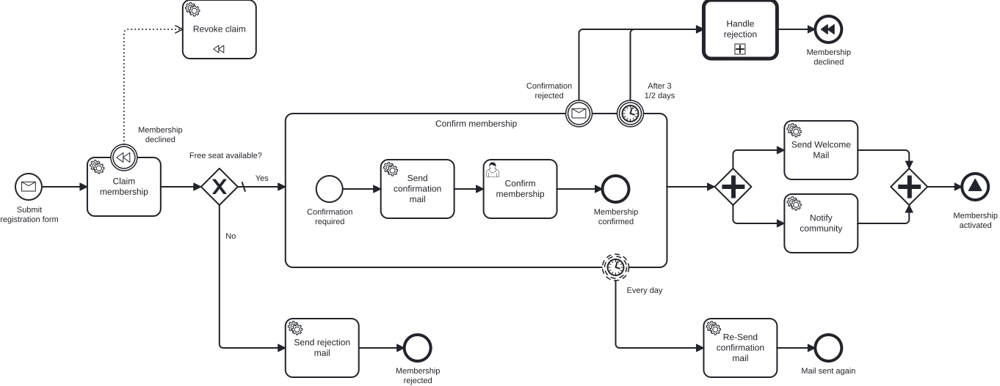

# Operaton Developer Training – Exercises

> 🇩🇪 **Deutsch** · [🇬🇧 English](README.md)

Willkommen zum Operaton Developer Training!

**Miravelo** ist ein Lifestyle-Online-Shop für Menschen in der Quarterlife-Crisis – Siebträger,
Laufausrüstung, Gravel Bikes, Rennräder. Das Unternehmen wächst, die Kundenbasis wächst,
und die Prozesse müssen mithalten.

In diesem Modul arbeitest du dich Schritt für Schritt durch 10 Aufgaben, die ein vollständiges
Inner-Circle-Membership-System auf Basis von Operaton (Camunda Platform 7) aufbauen.

## Der vollständige Zielprozess

So sieht der Prozess am Ende von Aufgabe 10 aus – mit allen Konzepten, die du Schritt für Schritt aufbaust:



Der ausgelagerte Sub-Prozess für die Ablehnung (Call Activity + DMN):


## Voraussetzungen

```bash
# PostgreSQL und MailHog starten (im Stack-Verzeichnis)
cd ../../stack && docker-compose up -d

# Anwendung starten (aus diesem process-application-Verzeichnis)
../../mvnw spring-boot:run

# Operaton Cockpit
http://localhost:8080/operaton/app/cockpit/  (admin / admin)
```

> Im Auslieferungszustand startet dieses Modul im Zustand von **Aufgabe 1** – die
> Operaton-Engine ist noch auskommentiert. In Aufgabe 1 schaltest du sie scharf.

## Aufgaben-Übersicht

| Aufgabe | Thema | Beschreibung |
|---|---|---|
| [0](../../docs/de/exercise-00.md) | Fachliche BPMN-Modellierung | Den kompletten Sollprozess rein fachlich mit Miragon BPMN Modeler erstellen |
| [1](../../docs/de/exercise-01.md) | Engine & Tooling | Das vorgegebene Start-Formular-/Manual-Task-Modell durchlaufen lassen, Cockpit & DB-Tabellen kennenlernen |
| [2](../../docs/de/exercise-02.md) | Der erste Wartepunkt | Aus dem Manual Task „Confirm" einen User Task mit selbst erstellter Generated Form machen |
| [3](../../docs/de/exercise-03.md) | Einen Schritt automatisieren | Aus dem Manual Task „Send welcome mail" einen Service Task + JavaDelegate machen (Start über Cockpit) |
| [4](../../docs/de/exercise-04.md) | Die Anwendung übernimmt | Message Start, REST-Endpunkte für Register + Confirm, Korrelation, Persistenz |
| [5](../../docs/de/exercise-05.md) | Membership & Gateway | Exclusive Gateway, Kapazitätsprüfung |
| [6](../../docs/de/exercise-06.md) | Prozess-Tests | Prozess-Unit-Test: In-Memory-Engine, gemockte Use Cases, ohne PostgreSQL |
| [6 · Add-on](../../docs/de/exercise-06-addon.md) | bpmn-to-code | Typsichere Process-API aus dem BPMN generieren – Strings raus, Konstanten rein |
| [7](../../docs/de/exercise-07.md) | Boundary Events & Subprozesse | Parallel Gateway, Timer- und Message-Boundary-Events, Subprozesse |
| [8](../../docs/de/exercise-08.md) | Kompensation (SAGA) | Automatisches Rollback via BPMN-Kompensation |
| [9](../../docs/de/exercise-09.md) | Call Activity & DMN | Prozess-Modularisierung mit Entscheidungstabellen |
| [10](../../docs/de/exercise-10.md) | Remote Engine & External Task | Notify-Community-Delegate als External Task in einen eigenen Remote-Worker auslagern, Benachrichtigung in einen Teams-Kanal |
| [Extra 1](../../docs/de/extra-task-1.md) | Process-Engine-API | Engine-Lock-in lösen: Worker statt Delegates, engine-neutraler Adapter-Layer |

## Architektur

Das Projekt folgt der **hexagonalen Architektur** (Ports & Adapters):

```
REST / Operaton Delegates     Application              Operaton / Database
  (inbound adapters)  →  ports + services  →     (outbound adapters)
                              ↑
                           Domain
                     (engine-neutral)
```

**Pakete unter `src/main/java/io/miragon/training/`:**

- `adapter/inbound/rest/` – Spring MVC REST-Controller
- `adapter/inbound/operaton/` – JavaDelegate-Implementierungen (`BaseDelegate`)
- `adapter/outbound/operaton/` – Prozess-Adapter (Prozess starten, Nachrichten korrelieren)
- `adapter/outbound/db/` – JPA-Persistenz-Adapter
- `application/port/inbound/` – Use-Case-Interfaces
- `application/port/outbound/` – Repository- und Prozess-Port-Interfaces
- `application/service/` – Use-Case-Implementierungen
- `domain/` – Reines Java Domain-Modell, keine Framework-Abhängigkeiten

## Architektur-Tests

```bash
../../mvnw test -Dtest=ArchitectureTest
```

Die ArchUnit-Tests prüfen zur Testzeit, ob die Architekturregeln eingehalten werden.

## Lösungen

Für jede Aufgabe gibt es eine Referenzlösung unter `../../solutions/exercise-X/`.
Jede Lösung ist eine eigenständige, lauffähige Spring Boot Anwendung.

Wenn du eine Aufgabe nicht ganz fertig bekommst, kannst du die Referenzlösung direkt in
dieses Modul kopieren und mit ihr weiterarbeiten (gültige Werte: 1–10):

```bash
../../mvnw antrun:run@load-solution -Dsolution=02
```

Der Task ersetzt `src/main` komplett (Java, `application.yaml`, BPMN/DMN); `src/test` bleibt
unberührt. Alle Module laufen auf demselben Port (`8080`) und DB-Schema (`exercise`), es läuft
also immer nur ein Modul zur Zeit. Voraussetzung ist, dass du in **Aufgabe 1** die
Operaton-Abhängigkeiten aktiviert hast (die `pom.xml` wird nicht mitkopiert).
